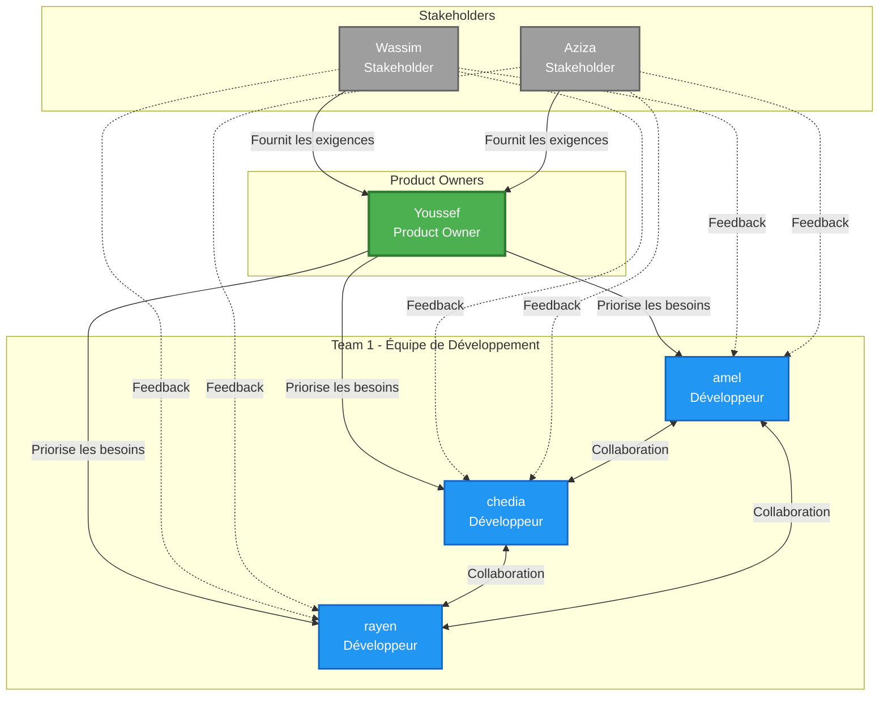
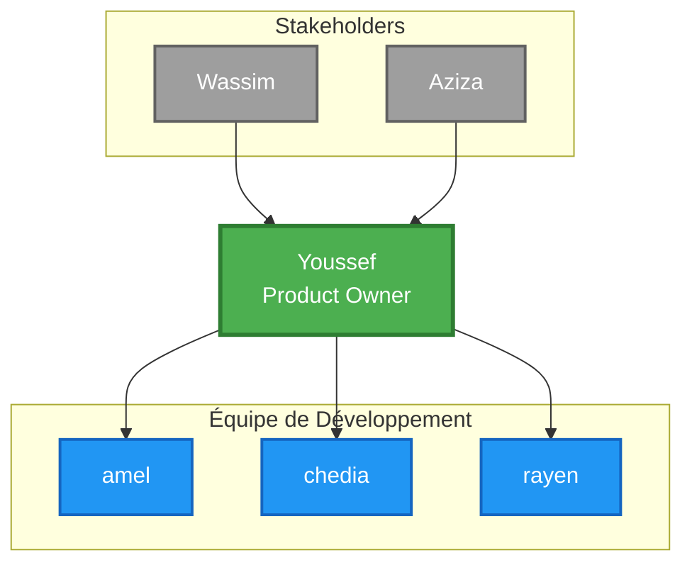

# Structure de l'Équipe Scrum

## Diagramme de l'Équipe



## Structure Hiérarchique



## Rôles et Responsabilités

### 👤 Product Owner
**Youssef**
- Définit et priorise le Product Backlog
- Communique la vision du produit
- Valide les fonctionnalités développées
- Représente les besoins des stakeholders

### 👥 Stakeholders
**Wassim & Aziza**
- Fournissent les exigences métier
- Donnent du feedback sur les livrables
- Valident les fonctionnalités
- Participent aux démonstrations (Sprint Review)

### 👨‍💻 Équipe de Développement
**amel, chedia, rayen**
- Développent les fonctionnalités
- Estiment les tâches
- Participent aux cérémonies Scrum
- S'auto-organisent pour atteindre les objectifs du Sprint

## Cérémonies Scrum

1. **Sprint Planning** : PO + Équipe
2. **Daily Scrum** : Équipe uniquement
3. **Sprint Review** : PO + Équipe + Stakeholders
4. **Sprint Retrospective** : Équipe uniquement

## Flux de Communication

```
Stakeholders (Wassim, Aziza)
    ↓ [Exigences & Feedback]
Product Owner (Youssef)
    ↓ [User Stories & Priorités]
Équipe de Développement (amel, chedia, rayen)
    ↓ [Livrables]
Product Owner (Youssef)
    ↓ [Validation]
Stakeholders (Wassim, Aziza)
```
